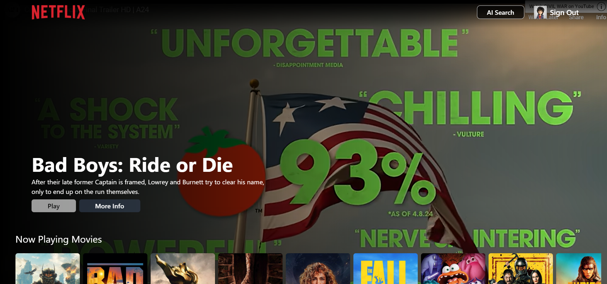

# 🎬 Netflix AI – Smart Movie Recommendation Platform

A modern Netflix-inspired web application that provides **AI-powered movie recommendations**, real-time search, and a seamless browsing experience using modern frontend technologies.

---

## 🚀 Live Demo

🔗 https://movieflix-abhay.netlify.app/

## 💻 GitHub Repository

🔗 https://github.com/abhayrobotics/netflix-gpt

---

## 📌 Overview

Netflix AI is a full-featured movie streaming UI that integrates **AI-based recommendations** with real-time movie data. The application focuses on delivering a smooth user experience with optimized performance and scalable architecture.

---

## ✨ Features

* 🔐 **User Authentication** (Firebase Auth)
* 🌐 **Multilingual Support**
* 🔍 **AI-Powered Search & Recommendations** (Gemini API)
* 🎥 **Real-time Movie Data Integration** (TMDB API)
* ⚡ **Fast & Responsive UI**
* 🔄 **Dynamic Routing & Navigation**
* 📱 **Fully Responsive Design**

---

## 🛠️ Tech Stack

**Frontend:**

* React.js
* Redux Toolkit
* React Router DOM
* Tailwind CSS

**Backend / Services:**

* Firebase Authentication
* TMDB API
* Gemini AI API

**Tools:**

* Vite
* Git
* Vercel (Deployment)

---

## 🏗️ Architecture & Design

The application follows a **component-based architecture** with centralized state management:

* **Redux Toolkit** for global state handling
* **Reusable UI components** for scalability
* **API abstraction layer** for clean data fetching
* **Separation of concerns** between UI and business logic

---

## ⚙️ Key Implementations

* Implemented **AI-driven recommendation system** using Gemini API
* Optimized API calls to reduce unnecessary re-renders
* Used **Redux store slicing** for better state organization
* Built **custom reusable components** for maintainability
* Implemented **lazy loading and routing optimization**

---

## 🧠 Challenges & Learnings

* Handling asynchronous API calls efficiently
* Managing global state across multiple components
* Designing scalable folder structure for large apps
* Integrating AI API with real-time UI updates

---

## 📸 Screenshots



## 📦 Installation & Setup

```bash
# Clone the repository
git clone https://github.com/abhayrobotics/netflix-gpt.git

# Navigate to project folder
cd netflix-gpt

# Install dependencies
npm install

# Start development server
npm run dev
```

---

## 🔐 Environment Variables

Create a `.env` file and add:

```
VITE_TMDB_API_KEY=your_tmdb_api_key
VITE_GEMINI_API_KEY=your_gemini_api_key
```

---

## 📈 Future Improvements

* Add watchlist & user preferences
* Implement video streaming support
* Improve recommendation accuracy
* Add unit and integration tests

---

## 👨‍💻 Author

**Abhay Kumar Gupta**

* GitHub: https://github.com/abhayrobotics
* LinkedIn: https://linkedin.com/in/developerabhay

---

## ⭐ If you like this project

Give it a ⭐ on GitHub and feel free to contribute!

<!--
# Netflix-GPT
AI-powered movie recommendation platform built with React, Tailwind, and OpenAI.

🔗 [Live Demo](https://netflix-gpt.vercel.app)

[FOR BEST RESULT USE VPN]


## Stack used
-   React
-   react-rounter-dom for navigation
-   Tailwind for Styling
-   React-redux for store
-   Firebase Authentication
-   Firebase Hosting
-   TMDB API for Movie data 
    - Setup VPN (currently tmdb not working)
    - created account
    - created a constant TMDBoption  with user api token.
    - useEffect to fetch anasyncrounouse api call
-   Gemini  AI 
-   Multi language

## Setup (WorkFlow)- Developer Guide
- npx create-react-app
    - delete the icon, test.js file and app.css code

- configure tailwind from website steps
    - follow https://tailwindcss.com/docs/guides/create-react-app

- configure react-router-dom
    - npm i -D react-router-dom
    - set up the main component as <Body /> in app.js
    - Set the path in the Body component using createBrowserRouter and RouterProvider methods
- Routing
- Header Component
- Login Form
- Signup Form
- signup form validation using regex and useRef hook
- hosting using firebase hosting
    - npm install -g firebase-tools
    - firebase login
    - firebase init
        - deploy  (optionally github action)
        - public directory to be :build 
        - single page app -NO
    
    - npm run build
- firebase deploy
- firebase authentication
    -  firebase sign up createUser... 
    -  firebase sign in create ...
-  install Redux and itds toolkit
    - npm i react-redux
    - npm i -D @reduxjs/toolkit 
- created redux using user slice
- implemented signout
- Redirectig to the relevant page , if log in/out  and not be url/location. enchancing security using useNavigate()
    - all navigating will be done in header component as it is present in all pages and inside the Router component.
- unsubscribe to the onAuthStateChange .
- Register TMDB api and create and app and token
- get data from TMDb "now playing movies"
- custom hook for now playing movies
-  create a movie slice
- update store with movie slice
- setting main browse page
    -Title component
    - video component
- fetch data for trailer video
- update store with trailer video
- embedded youtube video
- tailwind classes to style
- build "movie list container" ie movies slider
- created a generic hook for adding all types data in slider useAddMoviescategoryI(url, Popular)
- GPt Search Button
- GPT Slice in store with search view Action.
- conditional showing of GPT Search page
- GPTSearch
    - Search Bar
    - Movie Suggestions
- languages multilingual using langconstant 
- dropdown menu using select and option html tag
- setting the value using a config slice and storing that vale of preferred language
- only showing the language in search page
- setup open ai
    - create an account in platform.openai
    - npm install openai
    - openai setup 
        create a
- set up Gemini API (choosing this chat model  as Free)
    - create an account
    - npm install @google/generative-ai
    - creating geminiai.js page and initialise the model as per documentation.
    - hiding the api key in .env 
    - setting promt static(for formating and only output movies) + dynamic(based on input)
    - create a new queryResult Slicein store and add the result in store in an array using split
- set moviesugggestion component
    - get the query slice data from store by subscribing to store using useSelector
    - for each result , use search movie tmdb api call and set the result in queryTmdbresult Slice
    - using Movie List component render.
- Memoization: reduceing the api by first checking if the data is present in the store.
- Responsive
- (optional)
    - if TMDB fails add the hard coded data.
    - loads the data first from hardcoded data , then check  api for any new change
    - created a movieDetail card that show the detail of a movie when clicked ,
       - hardcoded data for browse page
       - live data for search movie


## Features
-   Login .signup page
    -sign in , sign up form 
    - redirect to browse page

-   browse (after authentication for log in user)
    - Header
        - user photo

    - Main Movie <MainContainer />
        - <VideoBackground />
        - <TitleContainer />
            - Title in description
            - play controls-                pending
    - <MovieListContainer />
        - movieslist - popular *n
            - MovieCard * n
                - MovieDetail
        - 

-   Netlfix Gpt
    -   Search Bar
    -   Movie suggestion .
    

## Bug
-    after changing language , even though store value in chnaged but selection option is not selected-❌
-    Movie detail , when tmdb not working not made-☑️
-   Error checking-partial done✔️
-   refresh firebase hosting error -☑️ using rewrite{}
-   overflow-xscroll ❌
-   Deployment in netifly: ☑️
    Runtime 
        Not set
    Base directory 
        /
    Package directory
        /build
    Build command
        CI= npm run build
    Publish directory
        /build
    Functions directory
        /netlify/functions

-   refresh page not found bug in netlify☑️
     I added a _redirects file inside the /public folder like /public/_redirects. I then pasted /*  /index.html  200 
    

## Standard properties
-   text x-margin- mx-8
-   text y-margin- mx-4
-   button px-10 py-1

  ## 🤝 Contributing
Open to PRs and feedback. Feel free to fork and improve!

## 📄 License
MIT


## pending features
-   icons
-   video controls- mute
-   video trailer for each movie shown 
 -->
